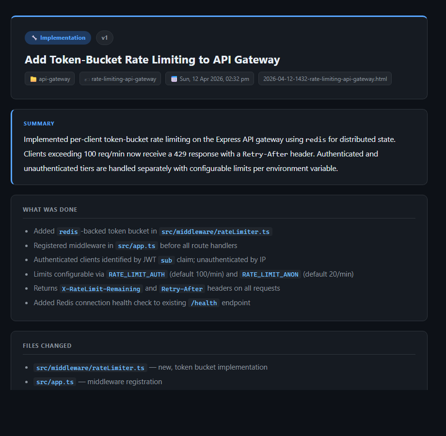
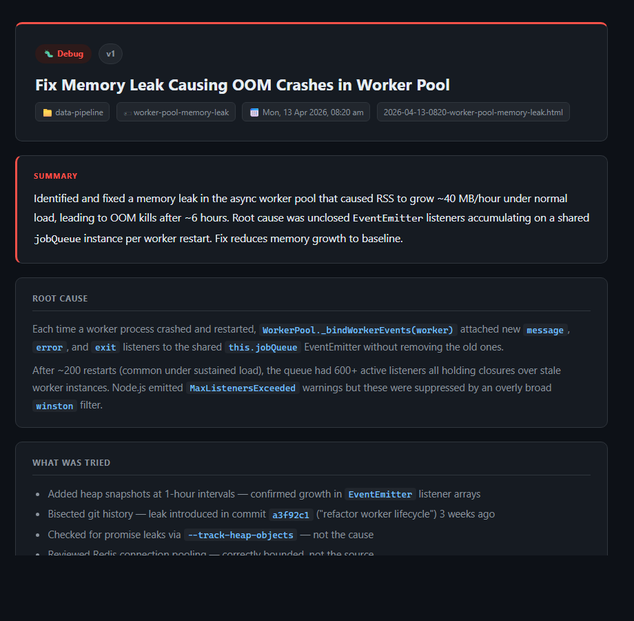

# pi-debrief

A pi extension that generates a single-page HTML briefing document at the end of significant work — so you can orient, assess, and decide without reading walls of terminal output.

---

## Why

When you use pi for a real task — implementing a feature, debugging a crash, planning a migration — the output is a long, interleaved stream of assistant messages, tool calls, and code diffs. By the time the work is done you have to either remember what happened or scroll back through everything to reconstruct the picture.

That friction compounds across a day. For a developer or solutions architect running multiple sessions across multiple repos, the cost of mentally re-parsing work you just did adds up. The brief is the answer to a simple question: *what just happened, what matters, and what comes next?*

The extension fits into pi without changing your workflow. You do not write the brief — the model does, using everything it has seen during the session. You get an HTML page that opens in your browser when the work is complete.

---

## What you get

A self-contained HTML page saved to `.pi/reports/` at the git root of your project (or `~/.pi/reports/` if you are not in a git repo). The page has:

- A **header** with task type badge, version label, repo name, slug, and timestamp
- A **summary** of 2–4 sentences — enough to orient you without reading further
- **Contextual sections** chosen by the model based on the type of work done

The model picks both the task type and the appropriate sections. Six types are supported:

| Type | Typical sections |
|---|---|
| 🔧 Implementation | What was done · Files changed · How to test · What's next |
| 🗺️ Planning | Context & Problem · Proposed approach · Alternatives · Pros & Cons · Recommendations · Open questions |
| 🔍 Research | Key findings · Details · Recommendations |
| 🔎 Review | Issues found · What's good · Recommendations · Priority fixes |
| 🐛 Debug | Root cause · What was tried · Fix applied · How to verify · Recurrence risk |
| 📋 Requirements | Functional reqs · Non-functional reqs · Assumptions · Out of scope · Risks |

---

## Examples

Open any of the `examples/` HTML files to see the full output for each type. Screenshots of two below.

**Implementation — rate limiting added to an API gateway:**



**Debug — memory leak investigation:**



---

## Usage

### Normal flow

You work with pi as normal. When the model decides the task is significant, it calls `write_html_report`. The brief opens in your browser. You can ignore it, read the summary, or work through the detail.

If you want a brief immediately without waiting for the model to decide, use `/debrief`.

### Commands

| Command | What it does |
|---|---|
| `/debriefs` | List and open reports grouped by slug. Primary command. |
| `/debriefs on\|off` | Enable or disable brief generation for this session |
| `/briefs` | Alias for `/debriefs` |
| `/debrief` | Ask the model to write a brief immediately for the current session |
| `/debrief-attach <slug>` | Cross-session: attach this session's work to an existing slug as a new version |

### Versioning

Briefs are grouped by **slug** — a short kebab-case identifier the model generates from the topic (e.g. `rate-limiting-api-gateway`, `auth-refactor`).

- Within a session: if you do follow-up work on the same topic, the model reuses the slug. The extension writes a new file (`v2`, `v3`, etc.) and `/debriefs` shows them grouped.
- Across sessions: versioning is explicit only. Use `/debrief-attach <slug>` to attach new session work to an existing slug.
- Files are never modified after writing. Version relationships exist only in the `/debriefs` display.

### Opting out

Use `/debriefs off` to suppress brief generation for the current session, and `/debriefs on` to re-enable. State persists through compaction and session resume.

### File locations

| Situation | Where briefs are saved |
|---|---|
| Inside a git repo | `<git-root>/.pi/reports/` |
| Not in a git repo | `~/.pi/reports/` |

The extension automatically adds `.pi/reports/` to `.gitignore` when saving the first brief in a repo.

`/briefs` shows both locations at once — global store first, then the current project.

---

## What the model generates (and does not)

The model provides structured content: a title, a 2–4 sentence summary, and a list of sections. The extension renders this into HTML using a fixed template. The model does not write HTML directly.

The model is guided to call `write_html_report` for:

- Implementation tasks, bug fixes
- Planning and architecture sessions
- Research and analysis
- Code reviews
- Debugging investigations
- Requirements scoping

It is guided to skip for simple questions, quick lookups, or trivial edits.

---

## Architecture

### Three moving parts

**1. `before_agent_start` event hook**

Fires once per session on first prompt to create `.pi/reports/` and update `.gitignore`. If briefs have already been written this session, it appends one line to the system prompt: the active slugs. This is the only per-turn injection and it only fires after the first brief exists.

**2. `write_html_report` custom tool**

Registered as a callable tool the LLM can invoke. The `promptGuidelines` field on the tool adds three bullets to the system prompt's Guidelines section while the tool is active — this is where the "when to call this" guidance lives, not in a separate system prompt injection. The tool accepts:

```typescript
{
  slug:     string    // kebab-case topic identifier
  taskType: "implementation" | "planning" | "research" | "review" | "debug" | "requirements"
  title:    string    // max 80 chars
  summary:  string    // 2–4 sentences
  sections: Array<{ heading: string; content: string }>
}
```

The extension renders this to HTML, counts existing files matching the slug to set the version label, writes the file, and opens it in the browser.

**3. Commands**

`/debriefs` (aliased as `/briefs`) reads both report directories, groups files by slug, and presents a two-level selector: pick a slug, then pick a version if more than one exists. When called with `on` or `off`, it toggles brief generation instead. `/debrief` and `/debrief-attach` send user messages to the model to trigger tool calls.

### Session state

Two pieces of state are persisted to the session via `pi.appendEntry`:

- `pi-debrief-slugs` — slugs written this session (used to build the one-line slug reminder)
- `pi-debrief-no-report` — the `/debriefs on|off` toggle state

Both are restored on `session_start` so they survive compaction and session resume.

### File naming

Files are always named `YYYY-MM-DD-HHmm-<slug>.html`. Files are never renamed or modified after writing. The version relationship (`v1`, `v2`, `v3`) is derived at write time by counting existing files matching the slug, and is displayed in the HTML header and in `/briefs`.

---

## Example files

The `examples/` directory contains one pre-generated HTML brief for each task type with realistic (fictional) content. The `generate-examples.js` script regenerates them using the same renderer as the extension.

```
examples/
  example-implementation.html
  example-planning.html
  example-research.html
  example-review.html
  example-debug.html
  example-requirements.html
  screenshot-implementation.png
  screenshot-debug.png
```
