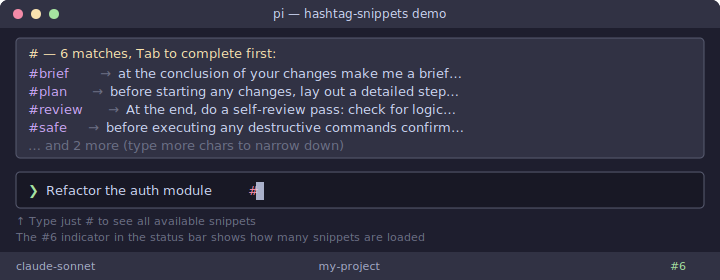
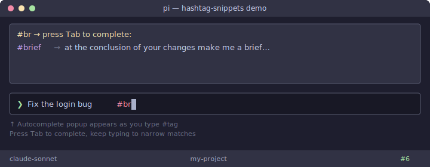
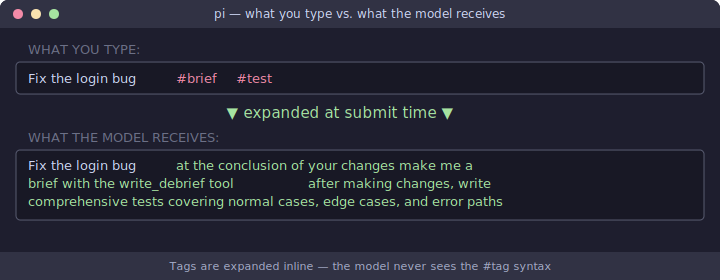

# pi-hashtag-snippets

A pi extension that adds **`#tag`-style snippet expansion** to prompts, with live autocomplete as you type.

## Quick Look

### Type `#` to see all your snippets



### Autocomplete narrows as you type — press Tab to complete



### Tags expand invisibly when you submit



---

## What it does

Type `#tagname` anywhere in a prompt. When you submit, it's replaced with the configured expansion text:

```
"Do the next task #brief"
→ "Do the next task at the conclusion of your changes make me a brief with the write_debrief tool"
```

**Live autocomplete** works like the `/` command picker: type `#br` and a completion list appears above the editor. Press `Tab` to complete.

## Install

```bash
cd pi-hashtag-snippets
npm install
```

Then add to your `~/.pi/agent/settings.json`:

```json
{
  "extensions": ["/path/to/pi-extensions/pi-hashtag-snippets/index.ts"]
}
```

Or install the whole `pi-extensions` package — it's already listed in `package.json`.

⚠️ **If pi starts with an extension error:** Make sure you ran `npm install` from the `pi-hashtag-snippets` folder (not just from the root `pi-extensions` folder).

## Configure

Snippets are loaded from two YAML files (both optional):

| File | Scope |
|------|-------|
| `~/.pi/agent/hashtag-snippets.yaml` | Global — applies to all projects |
| `.pi/hashtag-snippets.yaml` | Project — applies in this repo only |

Project snippets override global ones with the same key. See [`examples/`](./examples/) for ready-to-use templates.

### Format

```yaml
# Simple one-liner
brief: "at the conclusion of your changes make me a brief with the write_debrief tool"

plan: "before starting, lay out a detailed plan and wait for my approval"

# Multi-line value (YAML block scalar)
todoc: |
  After completing changes, add or update JSDoc for all modified functions.
  Cover: parameters, return values, example usage, and edge cases.
```

Tag names must be word characters (`[a-zA-Z0-9_]`).

## Usage

### Typing in prompts

```
"Refactor the auth module #plan"         → plan expansion
"Fix the login bug #brief #test"         → brief + test both expanded
"Add rate limiting #plan #todoc #brief"  → all three expanded in sequence
```

Multiple tags in one prompt all expand. Tags that don't have a matching snippet are left unchanged.

### Live autocomplete

1. Type `#` followed by letters → completion list appears above the editor
2. Press **Tab** to insert the first (alphabetical) match
3. Keep typing to narrow the list, then Tab
4. Press **Escape** or type something that doesn't match → list disappears

### `/hashtags` command

| Command | Action |
|---------|--------|
| `/hashtags` | Open browser — shows all snippets, select to insert |
| `/hashtags brief` | Insert `#brief` directly into the editor |
| `/hashtags bri` → Tab | Autocomplete argument to matching snippet name |

### Footer indicator

When snippets are loaded, the status bar shows `#N` (the count). Zero snippets = no indicator.

## Tips

- **Per-project standards** — put repo-specific snippets in `.pi/hashtag-snippets.yaml` and commit it. Teammates who install the extension pick them up automatically.
- **Chain tags** — `#plan #brief` gives you planning instructions AND a debrief at the end.
- **Override globals** — use the same key in `.pi/hashtag-snippets.yaml` to specialise a global snippet for this project.
- **Reload** — `/reload` picks up config changes without restarting pi.

## Note on `setEditorComponent`

This extension installs a custom editor component for the autocomplete widget. If another extension also calls `setEditorComponent`, the last one loaded wins. The expansion itself (via the `input` event) works regardless.
